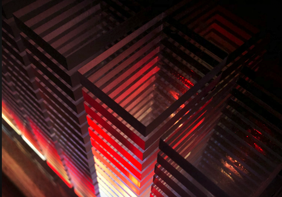

# 👋 Hi, I'm Piotr!

I'm a backend / rendering / systems engineer with an embedded background — now focused on **Rust backend, tooling, and systems development**. I've designed ARM drivers, built cloud-connected firmware, created CLI and web tools, and automated real-world processes.

### 🦀 [Multiplayer Game](https://github.com/Gieneq/RustMultiplayerGame) 

  🚧

  <em> In early development </em>

> **Techs:** Rust, Tokio, TCP, Axum

**Key features:**
- Asynchronous server built with Tokio
- User account management using Axum
- Character ingame control using TCP
- ECS world structuring
- Database adapter for testability

  
Details

  
<strong>Overview</strong>

  TODO

### 🧩 [RGB Audio Spectrum Display V3](https://github.com/Gieneq/Audio-Spectrum-Display-ESP32S3)

  
   
  

  <em>Audio Spectrum remote controller with visualization</em>

> **Techs:** C, ESP-IDF, ESP32C3/S3, ESP-NOW WiFi packets, Remote control, DSP, FFT, RGB animation

**Key features:**
- Custom enclosure & matrix design
- [ESP32S3](https://github.com/Gieneq/Audio-Spectrum-Display-ESP32S3) responsible for sampling, source selection, FFT, effect drawing, sending pixels colors
- [ESP32C3](https://github.com/Gieneq/DisplayRadioController399LED) responsible for receiving pixels colors and controlling the matrix
- Real-time analog/digital audio sampling
- 2048 FFT float 32 signal processing 
- 399-pixel WS2812B RGB LED matrix with custom animation effects
- LCD HMI for gain adjustment and effect selection
- sources: simulation, microphone, ADC wired

  
Details

  
<strong>Overview</strong>

  
The continuation of device to visualize audio signal using real-time FFT on an ESP32 platform, driving a 399-pixel RGB LED matrix with animated effects with additional WiFipackets communication.  

### 🦀 [Multiplayer Hide&Seek Game](https://github.com/Gieneq/RustMultiplayer) 

  

  <em> Gameplay 4 players: 3 hiders one seeker </em>

> **Techs:** Rust, Tokio, TCP, Serde, WGPU, Clap, thiserror

**Key features:**
- Asynchronous server built with Tokio
- WGPU-powered game client with real-time rendering
- CLI client alternative
- TCP communication using a JSON-based protocol
- Fully tested: unit and integration tests for client–server interaction

  
Details

  
<strong>Overview</strong>

  
A multiplayer mini-game built from scratch in Rust, featuring a custom async game server and real-time graphical and CLI clients.  

  
The game includes a lobby system, game state transitions, basic NPC behavior, and separate GUI roles depending on player type.

  
<strong>Project Scope</strong>

  <ul>
    <li>Async server handling multiple client connections and managing game world state </li>
    <li>In-game chat system distinguishing between server and client messages</li>
    <li>Shared client logic with both CLI and WGPU-based GUI frontends</li>
    <li>Decoupled client connections from in-game character state</li>
    <li>Procedural world generation</li>
    <li>Basic NPC AI logic and movement</li>
    <li>Game state transitions: lobby → active game → summary</li>
    <li>Reward system and scoring logic for winning players</li>
  </ul>

---

### 🦀 [Diamond Painting Generator](https://github.com/Gieneq/DiamondsImager)

  

> **Techs:** Rust, Axum, Serde, PDF, Clap, thiserror, palette, image

**Key features:**
- Uploads a source image
- Converts image into a printable diamond painting pattern
- Generates a DMC color palette and Bill of Materials
- *(Coming soon)* User accounts for project storage

  
Details

  
<strong>Overview</strong>

  
A personal project inspired by my wife’s hobby.

  
Users can upload an image, select available DMC colors, and receive a ready-to-print pattern along with a Bill of Materials (BOM) listing all required diamond colors and quantities.

  
<strong>Project Scope</strong>

  <ul>
    <li>REST API with endpoints for uploading images and tracking processing status  </li>
    <li>Image analysis and dithering using DMC-compatible palettes  </li>
    <li>Color quantization and matching using perceptual color distance</li>
    <li>Generates high-resolution PDF output for printing </li>
    <li>Optional UI planned for future use</li>
  </ul>

---

### 🦀 [ARM GDB External Memory Loader](https://github.com/Gieneq/GDB-Loader)

  

> **Techs:** Rust, Tokio, Clap, thiserror, GDB

**Key features:**
- CLI tool to upload binary files to external memory via J-Link and GDB
- Interacts with GDB using subprocess communication
- Chunks binary files to match memory page alignment
- Supports uploading files up to 4MiB

  
Details

  
<strong>Overview</strong>

  
Command-line utility for uploading binary data to external NOR Flash on ARM-based devices using a J-Link debugging probe. 

  
The upload process is mediated through a dedicated C-based upload API integrated into the firmware, which is called directly from the host via GDB during a debug session.

  
<strong>Responsibilities</strong>

  <ul>
    <li>Studied and leveraged GDB’s ability to call target-resident C functions via `call` commands</li>
    <li>Wrote a set of C functions exposed in the target firmware to receive and write memory chunks</li>
    <li>Implemented GDB subprocess automation and communication from Rust</li>
    <li>Designed chunked, page-aligned transfer with status feedback</li>
    <li>Built a robust CLI around this mechanism for ease of use in production/test environments</li>
  </ul>

---

### 🦀 Internet-connected steam sterilizer firmware

  

> **Techs:** C, C++, RTOS, Azure IoT HUB/DPS, TouchGFX, MQTT, HTTP, WebSocket, CRUD, TLS, STM32, ESP32

**Key features:**
- Responsive modern HMI,
- Logging to USB MSC & cloud
- Sterilization process selection

  
Details

  
<strong>Overview</strong>

  
Firmware for an Internet-connected steam sterilizer. Responsible for end-to-end embedded system design, including control logic, connectivity, and modern responsible user interface.

  
<strong>Responsibilities</strong>

  <ul>
    <li>Low-level memory driver:
      <ul>
        <li>Shared FMC bus: NOR + PSRAM with Read/Write management</li>
        <li>Buffering and caching</li>
        <li>External memory loading</li>
        <li>Failsafe filesystem</li>
        <li>Fragmentation monitoring</li>
      </ul>
    </li>
    <li>WiFi connectivity:
      <ul>
        <li>Manage WiFi connection</li>
        <li>Register device in Azure DPS using HTTPS</li>
        <li>Send telemetry, chunking & receive notification from IoT Hub via MQTTS</li>
        <li>Monitor new firmware & do OTA updates with backup</li>
        <li>RED Directive & service tools</li>
      </ul>
    </li>
    <li>Implement HMI project:
      <ul>
        <li>Custom TouchGFX components</li>
        <li>Optimized rendering</li>
        <li>External double framebuffer, external graphics data, FLASH write operations management</li>
      </ul>
    </li>
    <li>Sterilization process control:
      <ul>
        <li>Implementation of PID and hysteresis</li>
        <li>Heaters, pumps, valves control</li>
        <li>Optimizing physical process for speed</li>
      </ul>
    </li>
    <li>USB dual-role:
      <ul>
        <li>Host MSC to store process data, download firmware</li>
        <li>Device CDC/ACM Modbus for production, testing, and service</li>
      </ul>
    </li>
    <li>LED strips:
      <ul>
        <li>RGB animations</li>
      </ul>
    </li>
  </ul>

### 🦀 [CMake & Dev Container steam sterilizer firmware](https://github.com/Gieneq/STM32U5_CMake_DevContainer_TouchGFX_Template)

> **Techs:** C, C++, CMake, Google Test, Linker script, STM32U5, Docker, VS Code, GDB server

**Key features:**
- Full DevContainer setup to replace legacy IDEs like STM32CubeIDE
- Streamlined VS Code tasks and launch configurations for building, flashing, and debugging
- Remote debugging via external GDB server
- Unit tests runnable both on host (Google Test) and target
- CMake-based build system compatible with CubeMX and TouchGFX code generation

  
Details

  
<strong>Overview</strong>

  
Embedded projects are notoriously difficult to transfer between machines or contributors.  

  
This setup isolates the entire development environment inside a Docker DevContainer, making the project reproducible and portable across systems.  

  
It replaces heavier IDEs (e.g., Eclipse-based tools) with a modern, faster workflow using VS Code and Linux-based builds.

  
Due to USB device mapping limitations in containers, the GDB server is run outside the container — but integrates cleanly with the VS Code debugging workflow.

  
<strong>Responsibilities</strong>

  <ul>
    <li>Indepth knowledge how ST-Link and J-Link works
    <li>Built a CMake-based project structure compatible with STM32CubeMX and TouchGFX codegen</li>
    <li>Integrated remote debugging through ST-Link and J-Link </li>
    <li>Wrote custom VS Code tasks and launch configurations for building, flashing, and testing</li>
    <li>Automated host-side unit tests with Google Test  </li>
    <li>Analyzed .elf and .map files to enable reliable external memory loading (NOR/PSRAM via FMC) using GDB</li>
    <li>Replaced legacy IDEs with reproducible, Docker-based environment  </li>
  </ul>

  ### 🧩 [WiFi AccessPoint E-Ink Image Frame](https://github.com/Gieneq/C3eInkFrame)

  

    
  

  > **Techs:** C, ESP-IDF, JavaScript, HTML/CSS, PNG, Dithering, Captive Portal

  **Key features:**
  - ESP32-C3-based image frame with E-Ink display
  - Hosts its own WiFi Access Point and web server
  - JavaScript-based captive portal with image preview and upload
  - Uploads, crops, and dithers PNG files in-browser
  - Renders processed image on the E-Ink display

  

    
Details

    
<strong>Overview</strong>

    
A standalone E-Ink picture frame with built-in access point and web interface.  

    
Designed to display user-uploaded images without needing external services.  

    
The device serves a fully self-contained web app (HTML/CSS/JS), allowing users to crop, scale, dither, and upload images directly to the ESP32 for display.

    
<strong>Project Scope</strong>

    <ul>
      <li>Developed embedded web server with JavaScript-based frontend  </li>
      <li>Implemented captive portal for instant access after connecting  </li>
      <li>Created image processing pipeline: crop → grayscale → dithering → upload  </li>
      <li>Parsed and displayed PNG images on E-Ink display using custom rendering logic  </li>
      <li>Designed minimal, UI-first UX for non-technical users  </li>
    </ul>
  

### 🧩 [Python RPG game approach](https://github.com/Gieneq/LochPythonRPG)

  

> **Techs:** Python, PyGame, Tiled, TMX/TSX, Sprite animation, ECS-style design

**Key features:**
- Multilayer 2D RPG engine with animated pixel-art world
- Game object system using delegation over inheritance
- Custom property system for entity input, update, and render logic
- Support for TMX/TSX formats from Tiled map editor
- Collision system with object interaction and debug renderer
- Sprite + animation system with abstracted timing

  
Details

    
<strong>Overview</strong>

    
A 2D RPG engine inspired by classic top-down games like *Zelda*.  

    
Built in Python with Pygame, it features a layered tile-based world, animated entities, and a component-driven object system. 
 
    
While the project remains in development, it has laid a strong foundation for a full pixel-art RPG engine.

    
<strong>Project Scope</strong>

    <ul>
      <li>Implemented an extensible object model using Python properties and composition  </li>
      <li>Integrated TMX/TSX map parsing for Tiled-based level design  </li>
      <li>Built a collision system with layered obstacle detection and visual debugging  </li>
      <li>Developed pixel-art rendering pipeline with global scaling logic  </li>
      <li>Introduced modular animations and entity state management  </li>
      <li>Designed and integrated custom tilesets and graphics (WIP)</li>
    </ul>

### 🧩 [RGB Audio Spectrum Display](https://github.com/Gieneq/Audio-Spectrum-Display)

  

  <em>30+ ⭐ on GitHub · Featured on Instructables with 36k+ views and 190+ likes  
  <a href="https://www.instructables.com/Audio-Spectrum-Display-ASDV10-ESP32-399-WS2812B/">See project on Instructables ↗</a></em>

> **Techs:** C, ESP-IDF, ESP32, DSP, FFT, RGB animation

**Key features:**
- Custom enclosure & matrix design
- Real-time analog/digital audio sampling
- FFT signal processing on microcontroller
- 399-pixel WS2812B RGB LED matrix with custom animation effects
- Planned support for raw WiFi 802.11 audio streaming (in development)

  
Details

  
<strong>Overview</strong>

  
This project visualizes audio input using real-time FFT on an ESP32 platform, driving a 399-pixel RGB LED matrix with animated effects.  

  
It’s designed for living room aesthetics, performance, and modular expandability

### 🧩 Bluetooth Macro Keyboard

> **Techs:** C++, ESP32, Bluetooth

**Key features:**
- Custom-built keyboard with programmable macro keys
- Sends hotkey combinations via Bluetooth HID profile
- Configurable actions for productivity

  
Details

  
<strong>Overview</strong>

  
A compact, Bluetooth-enabled macro keyboard built using an ESP32 board.  

  
Designed to trigger custom key sequences for automation, shortcuts, and productivity tasks.

  
<strong>Project Scope</strong>

  <ul>
    <li>Implemented HID over Bluetooth communication  </li>
    <li>Programmed hotkey mapping logic using C++</li>
  </ul>

### 🏭 Remote-Controlled Exploration Boat for Historical Research

  

  <em>Representative image. Similar view was recorded by our vessel inside the flooded shaft. <a href="https://gazetawroclawska.pl/eksploruja-sztolnie-ukryte-przez-hitlerowcow-w-1945-roku-czy-kamienna-gora-w-lubaniu-moze-skrywac-zloto-wroclawia/gh/c5-18644463"> Source: gazetawroclawska. </a></em>

> **Techs:** C++, Arduino, CAN, 3D design, 3D print, Camera, RC, LED lighting

**Key features:**
- Custom remote-controlled vessel designed for underground exploration
- Equipped with real-time video streaming and lighting
- Operated via CAN from 20 meters below surface level
- Designed for harsh, low-visibility flooded environments

  
Details

  
<strong>Overview</strong>

  
A commissioned project to explore a flooded mineshaft located ~20 meters underground in Lubań, Poland.  

  
The vessel was designed to descend into the shaft via 10cm drill and transmit video footage for archaeological and safety assessment.

  
<strong>Project Scope</strong>

  <ul>
    <li>Designed custom electronics and control system for vessel navigation  </li>
    <li>Integrated video capture with LED lighting for visibility  </li>
    <li>Built a watertight enclosure and propulsion system (partially successful)  </li>
    <li>Supply power and control signals from the surface  </li>
    <li>Contributed to one of the first serious technical attempts to explore the shaft — later fully successful in follow-up expeditions</li>
  </ul>

### 🏭 Ink Stain Area Measurement Device for Printing Industry

  

> **Techs:** Python, OpenCV, Custom GUI, 3D Design, 3D Printing

**Key features:**
- Real-time image processing for stain area detection
- Automated measurement of ink wear on printing drums
- Physical device designed and 3D-printed for stable imaging conditions

  
Details

    
<strong>Overview</strong>

    
This project was commissioned by a printing company to simplify and speed up the process of evaluating wear on printing cylinders.  

    
Previously, this required expensive equipment and manual measurements. The new solution involved a custom device with fixed camera distance and lighting conditions, paired with OpenCV-based analysis.

    
<strong>Responsibilities</strong>

    <ul>
      <li>Designed and 3D-printed a custom enclosure to maintain consistent camera positioning</li>
      <li>Implemented a Python + OpenCV script to calculate ink stain surface area</li>
      <li>Tuned thresholding, perspective correction, and region isolation for robustness</li> 
      <li>Delivered an affordable and replicable device that reduced measurement time and cost</li>
    </ul>

### 🧩 GQuarter: [Custom 2D Game Engine & Editor](https://github.com/Gieneq/GQuarter)

  

> **Techs:** Java, LWJGL (OpenGL), Custom GUI, 3D rendering, Shaders

**Key features:**
- Custom game loop and rendering pipeline (OpenGL + GLSL shaders)
- Basic 3D graphics algorithms and scene graph structure
- Mipmapping, geomipmapping, fresnel effect, bloom, skybox
- Entity-Component System for object behavior and modularity
- Audio system for positional 3D sound playback
- Input system with mouse and keyboard support
- Integrated level editor with in-engine GUI

  
Details

    
<strong>Overview</strong>

    
 A custom game engine and level editor built in Java using OpenGL and LWJGL. Developed over 2 years as a personal challenge to understand real-time rendering, ECS-like architecture, and cross-cutting systems like audio, terrain generation, and GUI handling. 

    
 The project helped me explore full-engine architecture and taught me key lessons about code structure, coupling, and the value of testing and separation of concerns. 
 
    
 Heavily inspired by <a href="https://www.youtube.com/@ThinMatrix">ThinMatrix YouTube series</a>. 
 
    
<strong>Project Scope</strong>

    <ul>    
      <li>Custom OpenGL rendering pipeline and shader management</li>
      <li>Entity system for managing in-game objects</li>
      <li>Terrain rendering and water effects</li>
      <li>GUI and event system for in-engine editor tools</li>
      <li>Scene serialization and reloading</li>
      <li>Basic audio and camera logic</li>
    </ul>

### 🧩 (2011) Hexapod robot with Bluetooth control

  

  

  

  <em><a href="https://www.youtube.com/watch?v=l720J65UCUo">Competition video</a> – Wrocław University of Science and Technology</em>

[📺 National TV feature – TVP Info](https://www.youtube.com/watch?v=HK7IooV7AvY&ab_channel=TVPInfo)

> **Techs:** C++, Arduino, Inverse kinematics, Bluetooth

**Key features:**
- Custom mechanical design
- 3 degrees of freedom per leg
- Inverse kinematics for smooth body and leg motion
- Bluetooth-controlled via Android app
- Basic autonomous behavior using proximity sensors

  
Details

    
<strong>Overview</strong>

    

      A six-legged walking robot designed and built in high school — combining mechanical engineering, embedded software, and robotics.
    The project earned awards at robotics tournaments and received national media coverage.
    

    
<strong>Project Scope</strong>

    <ul>
      <li>Designed mechanical structure for body and 6 legs</li>
      <li>Wrote control algorithms for inverse kinematics and walking gait</li>
      <li>Implemented Bluetooth communication protocol</li>
      <li>Implemented basic autonomous behavior using sensor feedback (feet and head proximity)</li>
    </ul>

